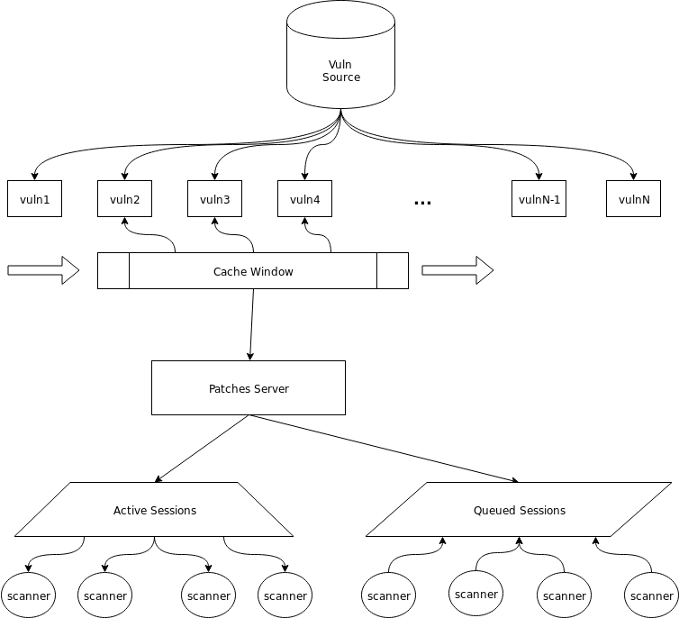

# Patches Server

The Patches-Server is responsible for handling Patches-Scanner sessions and
serving those scanners with active sessions a complete list of vulnerabilities
from one or more sources.

This document describes the function of the Patches-Server with reference to
its [architecture diagram](docs/Patches-Server-Architecture.png)

## Component Definitions

**Vuln Source**

> Any database or API that Patches-Server can read from to retrieve a list of
> vulnerabilities affecting a particular platform, such as Ubuntu 18.04.

**Vulnerability**

> A description of an exploitable malfunction present in a software package.

**Cache Window**

> A data structure that contains a strict subset of a larger total set of data.
> A cache window "slides" forward through the set of data it provides read
> access to as readers retrieve the data contained by the cache.

**Patches Server**

> A web server that handles active and queued sessions for scanners. Scanners
> that are members of the "active sessions" collection are granted read access
> to the contents of the cache window maintained by the server.

**Active Sessions**

> A subset of sessions connected to scanners reading from the cache window.

**Queued Sessions**

> A subset of sessions connected to scanners waiting to be granted read access.
> Note that the union of active and queued sessions is equal to the set of all
> sessions.

**Patches Scanner**

> Also called scanners. The client/agent component of Patches.  Scanners read
> information about vulnerabilities served by Patches-Server and scan their
> host for the vulnerable packages they are informed about.

## Memory Efficiency Problem

A source such as [CoreOS' Clair](https://github.com/coreos/clair/) may contain 
gigabytes of information about vulnerabilities affecting different platforms.
In light of this, Patches-Server must be able to reliably serve scanners
information from such sources without exhausting its host's memory resources
each time a session becomes active.

Stated more concretely, Patches-Server must satisfy the following constraints:

1. All scanners granted active sessions must be served all vulnerabilities
present in vulnerability sources supported by Patches-Server.
2. All scanners that attempt to open a session with Patches-Server must
eventually be granted an active session or be denied explicitly.
3. No more than a pre-defined amount of memory may be consumed by the server at
any given point in time.

To accomplish this, Patches-Server employs two tactics:

1. Maintain a cache window that serves as a read-only view into the complete
collection of vulnerabilities. Active sessions will be blocked on reads to the
window to guarantee that all active sessions' scanners retreive all vulns.
2. Maintain "active sessions" and "queued sessions" collections, granting read
access to a cache window to active sessions' scanners before moving queued
sessions into active sessions once all active sessions complete or timeout.

This approach requires that Patches-Scanners frequently poll the
Patches-Scanner to both retrieve vulnerabilities and prevent their session from
timing out and being expelled from either collection of sessions. While a
scanner's session is "queued," it will be informed that no vulnerabilities are
prepared for it until that session is made "active" and a new window is created.
